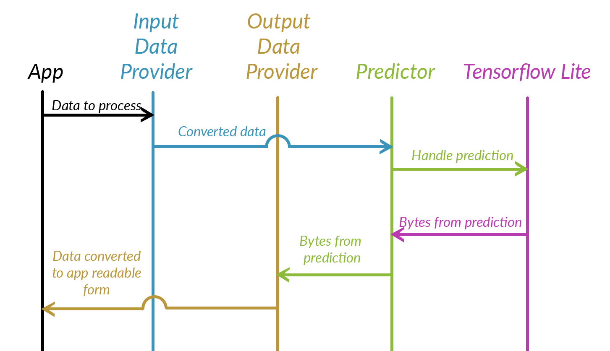

# Macaque

Easy Kotlin/Java SDK for everyone who wants to start with Machine Learning on mobile devices.

## Table of Contents

* [General info](#general-info)
* [Tools and Requirements](#tools-and-requirements)
* [Setup](#setup)
* [Features](#features)
* [Design](#design)
* [Typical usage](#typical-usage)
* [Example applications](#example-applications)
* [Adapting data providers for custom models](#adapting-data-providers-for-custom-models)
* [Call for contribution](#call-for-contribution)


## General Info

The main motivation behind the Macaque is to facilitate embedding ML models into mobile applications.
We hope that with our SDK programmers with no AI experience will be able to achieve that goal in no time.
Our solution comprises of macaque library and two sample projects.

There exists also an iOS implementation of Macaque which can be found [here](https://github.com/EnigmaPatternInc/Macaque_ios).

## Tools and Requirements

- Android Studio 3.x
- Phone or Emulator with Android 5.0 (API level 21) - tested on Android 9.0


## Setup

1. Clone the repository
2. Open it as a project in Android Studio
3. Build 'macaque' module (Gradle -> macaque -> Tasks -> build -> build)
4. Copy macaque-release.aar library file to 'libs' folder of your application's project
5. Set up your `build.gradle` file to load .aar libraries
   (i.e. in `dependencies` block there is entry like `implementation fileTree(dir: 'libs', include: ['*.aar'])`
6. After syncing gradle library is ready to use and can be found in `com.enigmapattern.macaque` package

## Features
- [X] Support of TensorFlow Lite
- [X] Support for TensorFlow
- [ ] Support for PyTorch 1.x
- [X] Effortless embedding of selected detection and classification models into a mobile application

	Models tested and used in example apps:
	* SSD object detector  [LINK](https://storage.googleapis.com/download.tensorflow.org/models/tflite/coco_ssd_mobilenet_v1_1.0_quant_2018_06_29.zip)
	* Mobilenet classifier [LINK](https://storage.googleapis.com/download.tensorflow.org/models/tflite/gpu/mobilenet_v1_1.0_224.tflite)

- [X] Embedding of custom models with small boilerplate code
- [X] Support for quantized and unquantized models
- [ ] Support for detection models returning locations relative to anchor boxes
- [ ] Support for PoseNet models
- [ ] Support for models not based on images.

## Design

### Concept of Submodules

Each instance of Macaque contains three submodules, each dedicated
for other type of actions. There are following categories of submodules:
* Input Data Providers - their role is taking and storing data from the
user and providing it to the Macaque in format expected by the used 
Predictor.
* Predictors - they take data from Input Data Provider, send it to 
library handling the model for inference then takes and returns raw 
results to the Output Data Provider
* Output Data Providers - they take results from the model, parse it and
return in form expected by the user.



### Submodules implementations provided with library

#### Input Data Providers

* BitmapToUINT8DataProvider - Expects user to provide Bitmap object to 
`currentImage` property, and converts it to form accepted by quantized
models operating on images.
* BitmapToFloatDataProvider - Expects user to provide Bitmap object to 
`currentImage` property, and converts it to form accepted by 
non-quantized models operating on images.

#### Output Data Providers
* Detector4outputsBoundingBoxesDataProvider - Operates on ByteBuffers,
takes results from detection models with 4 following output tensors: 
Locations, Classes, Scores, Number of detections (please note that 
tensors have to be in that order but do not have to have the same 
names). Returns list of DetectionResult objects.
* ClassifierDataProvider - Operates pm ByteBuffers, takes results from
classification models with single output tensor where to each index, 
representing class, there is assigned confidence score. Returns list
with single ClassificationResult object.

#### Predictors
* TensorFlowLitePredictor - default predictor for mobile usage. It 
utilizes TensorFlow Lite Interpreter. Requires use of properly converted 
models. Currently not all TensorFlow models can be converted to TensorFlow
Lite. Initialization of this predictor is straightforward - only path 
to the model needs to be provided. Optionally flags to use GPU or NNApi 
(Android Neural Networks Api) can be set. There are optional 
constructors if further customization is required - look at the 
documentation in the code for more information.
* TensorFlowPredictor - It utilizes TensorFlow Inference Interface. It
can run all TensorFlow models. Initializing it requires from user 
providing model path as well as names and shapes of input and output
tensors. There is optional constructor if further customization is 
required - look at the documentation in the code for more information.

## Typical usage

1. Select and instantiate proper input and output data providers eg.:
```
val inputDataProvider = = BitmapToUINT8DataProvider()
val outputDataProvider = Detector4outputsBoundingBoxesDataProvider()
```
2. Instantiate predictor object (provide model path, references to input and output data providers and, optionally, one of flags
useGPU or useNNApi):
```
val modelPath = File(modelsDir, "coco_ssd_mobilenet_v1_1.0_quant_2018_06_29.tflite")
val predictor = Predictor(modelPath.absolutePath, inputDataProvider, outputDataProvider, useGPU = true)
```
3. Provide data to input data provider:
```
inputDataProvider.currentImage = someBitmap
```
4. Run prediction:
```
predictor.predict()
```
5. Get properly parsed results from results provider:
```
val resultsList = outputDataProvider.getResults()
```

## Example applications

* MacaquePreview - uses simple classifier
(eg. [this](https://storage.googleapis.com/download.tensorflow.org/models/tflite/gpu/mobilenet_v1_1.0_224.tflite))
and classifies photos either taken by device camera application or loaded from memory.

* MacaqueLivePreview - uses detection model
(eg. [this](https://storage.googleapis.com/download.tensorflow.org/models/tflite/coco_ssd_mobilenet_v1_1.0_quant_2018_06_29.zip))
and detects various objects on live preview.

Please note that in both applications model is not provided with source
code. It has to be downloaded separately (e.g. from links above) and
side-loaded to the `files/models` folder within app directory on external
memory (e.g. `/mnt/sdcard/Android/data/com.enigmapattern.macaquelivepreview/files/models`).

## Adapting data providers for custom models

### Customizing input data providers

Custom input data providers have to implement `InputDataProvider` interface. They have to implement way of storing data provided by the user - in our implementations it is public `var currentImage: Bitmap` field. Moreover they have to override two methods of implemented interface: 
* `data(forShapes: IntArray): Array<out Any>` - converts data provided by user into the Array of objects, usually ByteBuffers
* `close()` 					 - cleans all resources utilized by the input data provider

### Customizing output data providers

User's output data providers have to extend `OutputDataProvider` class and override the following method.

* `getResults(): List<Any>` - converts model's output into format expected by the application. Note that if a single result is returned, it has to be in the form of a single-element list.

By default `OutputDataProvider` stores results in `HashMap<Int, ByteBuffer>`.
It can be customized to utilize arrays (e.g. `HashMap<Int, FloatArray>`).
To do that you have to override three methods:

* `initializeOutputHashMap(outputTensorsTypeSizes: Array<Int>, outputTensorsShapes: Array<IntArray>)` - for approprite initialization of the array
* `resetOutputsHashMap()` - originally it rewinds buffer's "head" when it is to be read again, for custom implementation with arrays instead of buffers it should be left empty.
* `close()` - cleans the array
 
## Call for contribution

Our Macaque is new on the market. There is still a lot to be done before it is mature. But the base is there and it is also for you to take your part in its development! We encourage everyone to tell their thoughts, request changes or features (e.g. via GitHub issues system) and of course by improving our codebase with pull requests. Let’s make Macaque better together!
